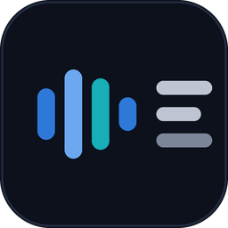
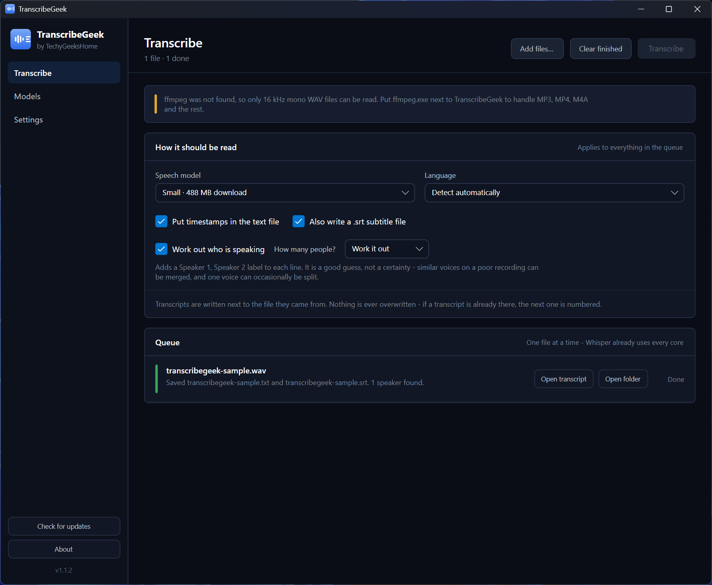
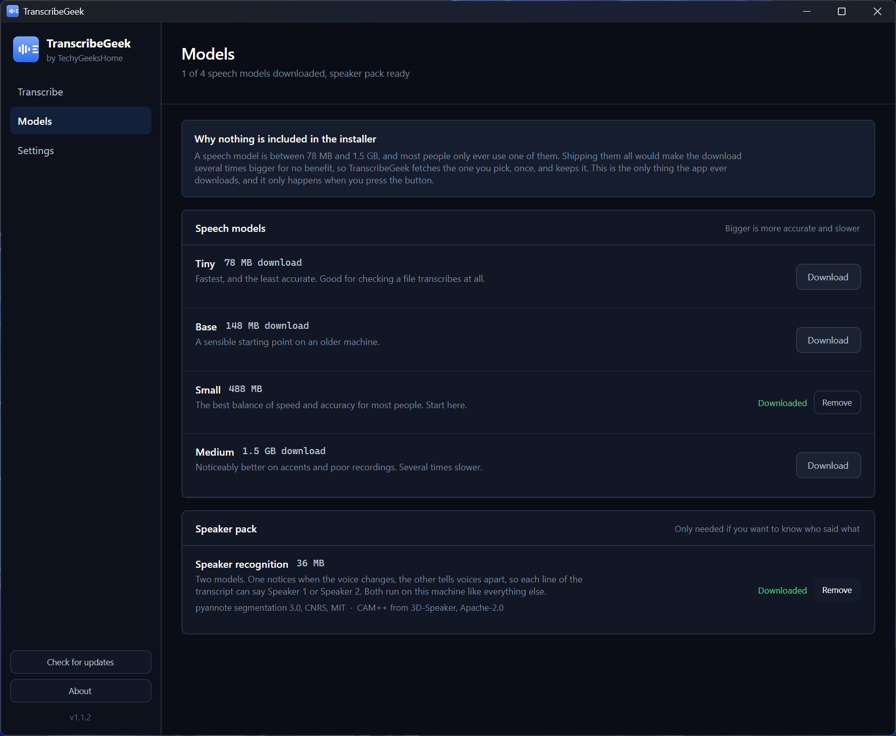
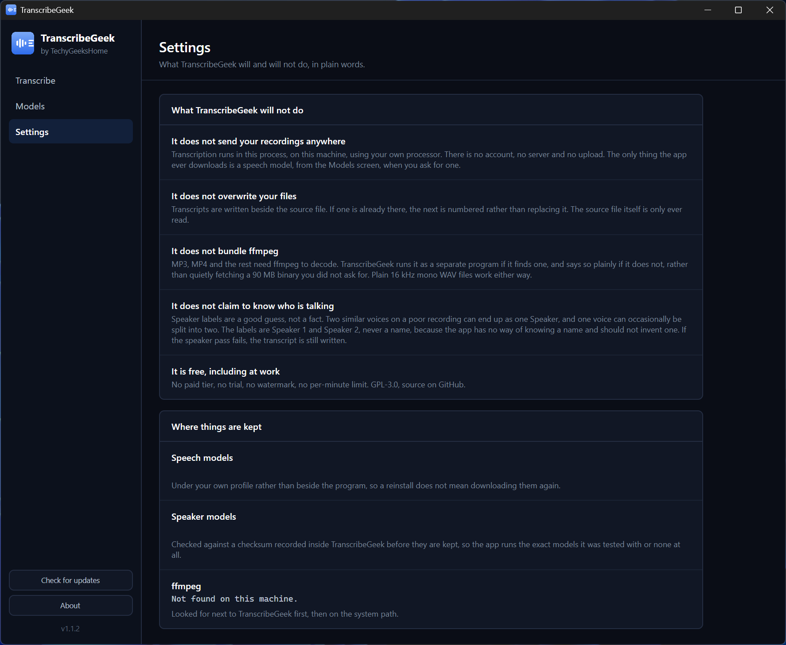

<div align="center">



# TranscribeGeek

**Turns recordings into text and subtitles, on your own machine. No account, no upload, no per-minute limit.**

[](https://github.com/techygeekshome/TranscribeGeek/actions/workflows/build.yml)
[](https://github.com/techygeekshome/TranscribeGeek/releases)
[](#download)
[](LICENSE)
[](https://techygeekshome.info)
[](https://ko-fi.com/techygeekshome)

[Download](#download) · [What it does](#what-it-does) · [Speech models](#speech-models) · [Who is speaking](#who-is-speaking) · [Requirements](#requirements)

</div>

---

Drop in audio or video and TranscribeGeek writes out a transcript, and a `.srt` subtitle file if
you want one. It runs OpenAI's Whisper speech models locally through
[whisper.cpp](https://github.com/ggerganov/whisper.cpp). There is no account, no server, no
upload and no per-minute limit. The recording never leaves the computer it is on.

Part of the [TechyGeeksHome](https://techygeekshome.info/geek-tools/) range.

---

## Download

**[Download the latest release](https://github.com/techygeekshome/TranscribeGeek/releases/latest)**, or read about it on the
**[TranscribeGeek product page](https://techygeekshome.info/transcribegeek/)**.

Windows 10 or 11, 64-bit. Nothing else to install.

---

## What it does

- Transcribes WAV, MP3, M4A, FLAC, OGG, Opus, WMA, AAC, MP4, MKV, MOV, AVI, WebM
- Writes a plain text transcript beside the source file, with or without timestamps
- Writes a SubRip `.srt` subtitle file alongside it
- Queues as many files as you like and works through them one at a time
- 22 languages, or automatic detection
- Works out who is speaking, labelling each line Speaker 1, Speaker 2 and so on


## Screenshots

<div align="center">

**Transcribe** — drop files in, pick a model and a language, and let it work through the queue.



**Models** — four speech models and the speaker pack, downloaded only when you ask.



**Settings** — a plain list of what TranscribeGeek will not do.



</div>

---

## What it will not do

- **It does not send your recordings anywhere.** Transcription runs in-process using your own
  processor. The only thing the app ever downloads is a speech model, from the Models screen,
  when you ask for one.
- **It does not overwrite your files.** If a transcript is already there, the next one is
  numbered. The source file is only ever read.
- **It does not claim to know who is talking.** Speaker labels are a good guess, not a fact. Two
  similar voices on a poor recording can end up as one speaker, and one voice can occasionally be
  split into two. The labels are Speaker 1 and Speaker 2, never a name. If the speaker pass fails,
  the transcript is still written.
- **It does not bundle ffmpeg.** MP3, MP4 and the rest need ffmpeg to decode. TranscribeGeek runs
  it as a separate program if it finds one and says so plainly if it does not, rather than
  quietly fetching a 90 MB binary you did not ask for. Plain 16 kHz mono WAV files work either
  way.

---

## Speech models

Nothing is included in the installer. A model is between 78 MB and 1.5 GB, and most people only
ever use one, so TranscribeGeek fetches the one you pick and keeps it in
`%LocalAppData%\TechyGeeksHome\TranscribeGeek\models`.

| Model | Download | When to use it |
|---|---|---|
| Tiny | 78 MB | Checking that a file transcribes at all |
| Base | 148 MB | An older machine |
| Small | 488 MB | The usual choice, start here |
| Medium | 1.5 GB | Accents and poor recordings. Several times slower |

---

## Working out who is speaking

Optional, off until you download it, and it runs on the same machine as everything else.

Tick **Work out who is speaking** on the Transcribe screen and each line of the transcript is
labelled Speaker 1, Speaker 2 and so on, numbered in the order the voices are first heard. If you
know how many people are on the recording, say so in the dropdown next to it, because that is the
one thing you know for certain and the model has to guess at.

It needs a 36 MB speaker pack, downloaded from the Models screen:

| File | Size | Origin |
|---|---|---|
| `pyannote-segmentation-3-0.onnx` | 6 MB | [pyannote segmentation 3.0](https://huggingface.co/pyannote/segmentation-3.0), CNRS, MIT |
| `campplus-voxceleb-16k.onnx` | 30 MB | [CAM++ from 3D-Speaker](https://github.com/modelscope/3D-Speaker), Apache-2.0 |

Both are checked against a size and a SHA-256 recorded inside TranscribeGeek before they are kept.
A file that does not match is deleted rather than used, so the app runs the exact models it was
tested with or none at all. They are run through
[sherpa-onnx](https://github.com/k2-fsa/sherpa-onnx) (Apache-2.0).

Recordings up to four hours are supported. Past that the transcript is still written but the
speaker pass is skipped and says so, because the whole recording has to be held in memory at once.

In the text file the name appears where the speaker changes rather than on every line. In the
`.srt` it appears on every caption, because a viewer sees one caption at a time.

---

## ffmpeg

Put `ffmpeg.exe` next to `TranscribeGeek.exe`, or anywhere on your `PATH`. Builds from
[ffmpeg.org](https://ffmpeg.org) or `winget install Gyan.FFmpeg` both work. If `ffprobe` is
beside it, the queue also shows how long each recording is.

---

## Requirements

Windows 10 1809 or later, 64-bit. .NET 8 is included in the installer build.

---

## Building

```
dotnet build TranscribeGeek.sln -c Release
```

---

## Licence

GPL-3.0. Free to use, including at work. No paid tier, ever.
